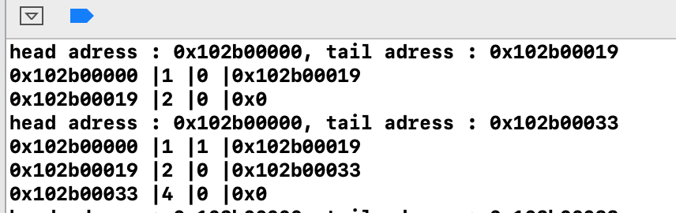
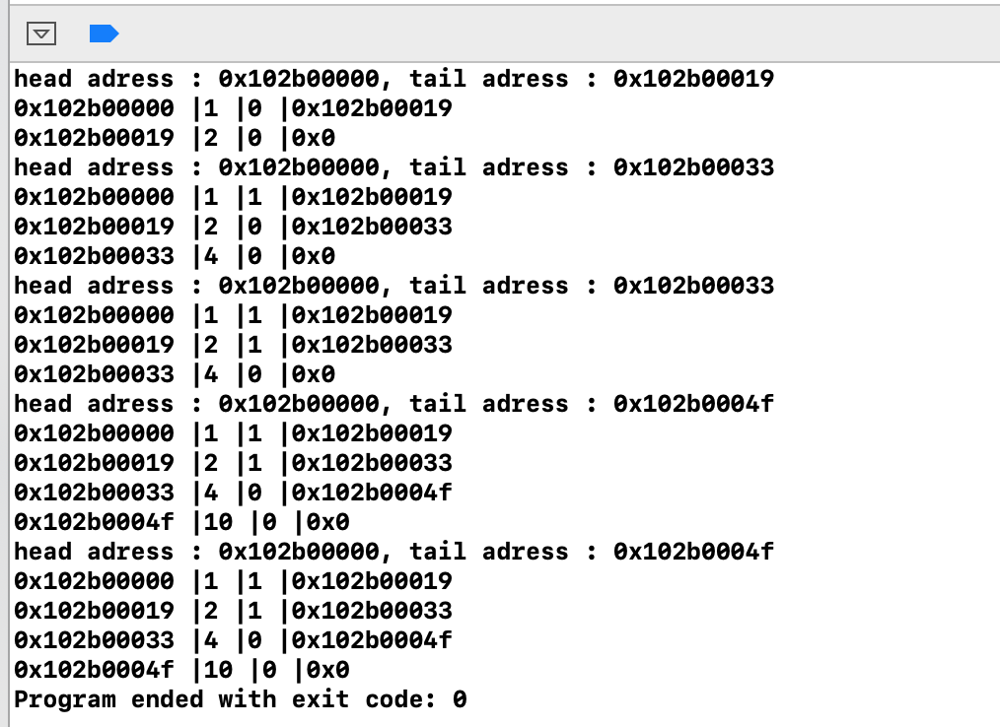

# laba_os1

# Аллокатор памяти общего назначения

# Работа алгоритма

void *mem_alloc(size_t size)

void mem_free(void *block)

void *mem_realloc(void *block, size_t size)

Назначим два блока по 1 и 2 байт. Теперь они видны в списке

Выполним функцию mem_realloc(x7, 4), изменим размер первого блока, так как размер первого блока меньше чем мы планируем добавить, этот блок помечается пустым, а вместо него добавляется новый, третий блок памяти с новым размером байт(4). 

mem_free(x8);
Освободим второй блок памяти, теперь он помечен как пустой.

